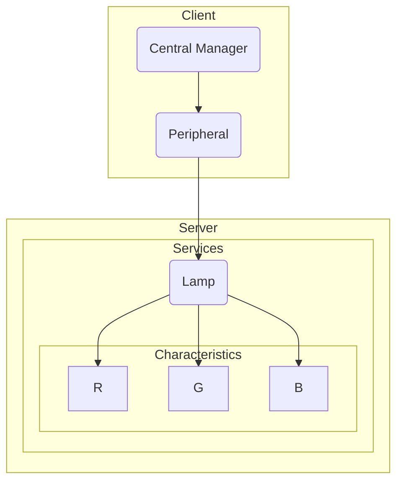

# EnVision-Tutorial-Lamp
 
# Overview

```mermaid
flowchart TD
P --> C
    subgraph Client
    A(Central Manager) --> P(Peripheral)
    end

    subgraph Server
    subgraph Services
    C(Lamp) --> R
    C --> G
    C --> B
    subgraph Characteristics
    R
    G
    B
    end
    end
    end
```